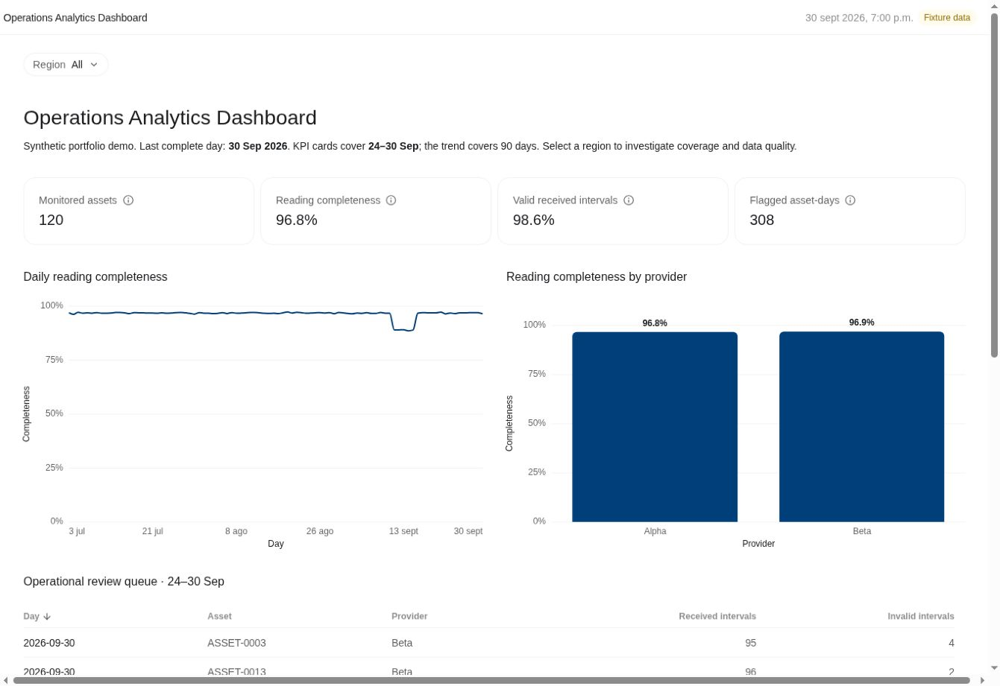

# Operations Analytics Dashboard

**From operational readings to a focused review queue.** A personal portfolio demonstration by Diego Gallo: Python generates synthetic asset-day observations, SQLite calculates reproducible metrics, and a self-contained web dashboard presents coverage, data quality and exceptions.

[Open the live interactive demo](https://diiego2102.github.io/operations-analytics-dashboard/)



## What to explore

- 120 fictional assets, 90 days and 10,800 asset-day records.
- Regional filters covering KPI cards, trend, provider comparison and review queue.
- Weighted completeness and validity rates, with explicit denominators.
- Rule-based exception detection and a deliberately injected outage.
- Reviewable SQL, a unique-key data contract and independent reconciliation tests.

**Every record and provider is fictional.** This is a newly implemented portfolio demo, not an employer system, company dataset or production-performance claim.

## Run in two minutes

Run from the root of this repository (`operations-analytics-dashboard`).

Python 3.11 or later; no third-party packages required.

```bash
python pipeline.py
python -m unittest discover -s tests -v
```

Open **`index.html`** in your browser. It contains the complete reviewed snapshot and works offline without a server. The command regenerates the deterministic data and verifies that the embedded HTML manifest, snapshot and source definitions match. It fails if the presentation is stale. The HTML remains a fixed export, with no live connection. For changed definitions or data, run `python pipeline.py --renderer /path/to/deliver_portable_artifact.mjs` in the canonical authoring environment, then review the export. The exporter is an external authoring dependency and is not bundled in this repository; ordinary users can reproduce and verify the checked-in snapshot without it.

From GitHub, use **Code → Download ZIP** and extract the folder, or **Code → Codespaces** to run Python in a browser terminal. No Codespace is started by this repository. `index.html` is also suitable for static hosting; The reviewed snapshot is published on GitHub Pages.

## Data contract

Grain: one fictional asset per day. Key: `(day, asset_id)`. Expected intervals: 96 per day. Received intervals must be between zero and expected; invalid intervals must be between zero and received. Counts are never inferred from missing rows: the generator explicitly creates every asset-day.

KPI window: **24–30 September 2026**, inclusive. Trend: **3 July–30 September 2026**. Completeness is `SUM(received)/SUM(expected)`. Validity is `(SUM(received)-SUM(invalid))/SUM(received)`; zero received yields null. A review flag means less than 90% completeness or more than 2% invalid received intervals. This is a prioritisation rule, not a machine-learning detector or equipment diagnosis.

The “All” view aggregates numerators and denominators directly. It does not average regional percentages. Provider comparisons are descriptive and not adjusted for asset mix. The deliberately injected South/Beta outage runs from 11–15 September.

## Repository

`pipeline.py` → generator, SQLite load, extracts and canonical snapshot. `sql/metrics.sql` → metric definitions. `tests/` → grain, constraints, denominator reconciliation and deterministic outage checks. `artifact.json` → reviewed presentation specification and bounded data. `index.html` → self-contained snapshot. `outputs/` → regenerated local data, excluded from Git.

## Español

Proyecto propio de analítica operativa con Python, SQL y dashboard web: seguimiento de lecturas, calidad de información y cola de incidencias. Demuestra cómo convertir datos operativos en indicadores y acciones de revisión. Los datos son completamente sintéticos y el dashboard muestra una instantánea, sin conexión a sistemas empresariales.

## Next steps

Add configurable date windows and prior-period comparisons. Keep data provenance and KPI reconciliation tests when replacing generated data with an authorised source. Source code is available for portfolio review; no open-source licence has been assigned.

## Clone this project

```bash
git clone https://github.com/diiego2102/operations-analytics-dashboard.git
cd operations-analytics-dashboard
```

Follow the run commands above from this folder.

[Business case](docs/CASE_STUDY.md) · [Interview walkthrough ES / EN](docs/INTERVIEW_ES_EN.md)
